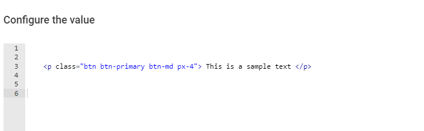

## Customize Page HTML CSS:

1. Click on the "add" button

2. Select a layout

3. Click on the "add" button to add a component

4. Select "HTML Embed"

5. Template created

6. Click on the "Edit" button to update the HTML contents

7. Update the content

8. Click "Update" to save

9. Add CSS in the "Extended style"

10. You are able to create and add your own CSS rules to this section.

11. For this example, we will use bootstrap.min.css

12. Copy the CSS in
[bootstrap.css](../css/bootstrap.css)

13. Paste into the "Extend CSS rules" box

14. Result:

