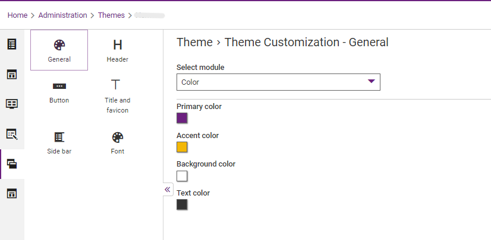
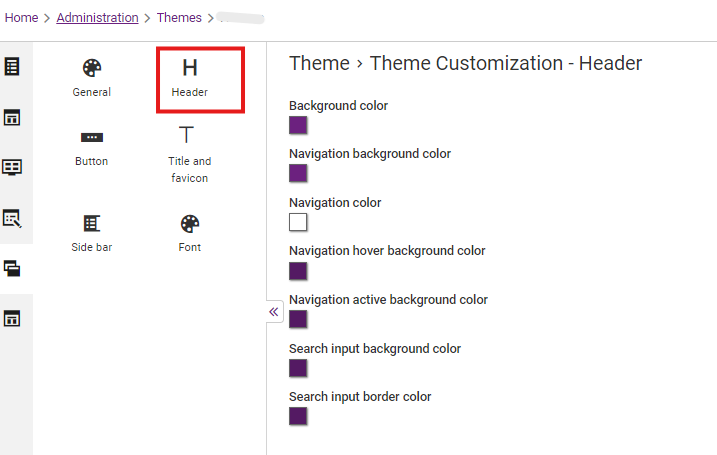
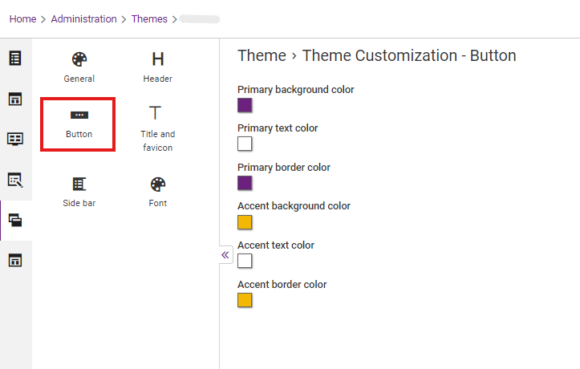
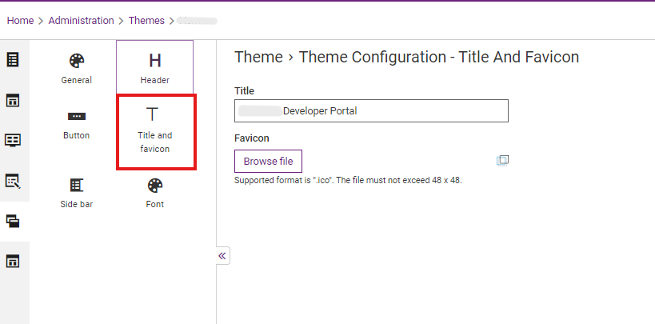
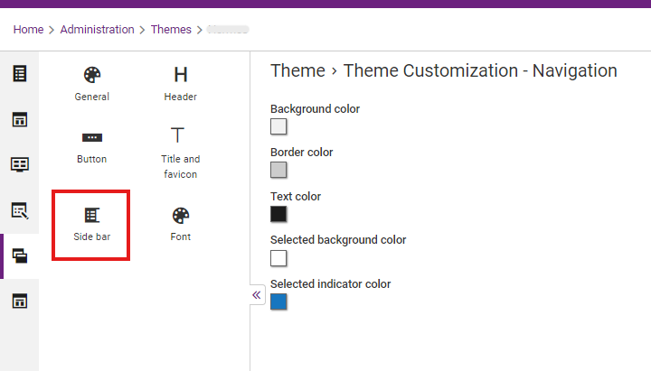
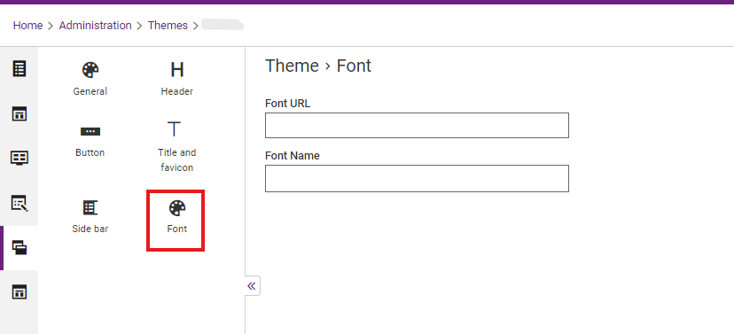

## Theme Customization:

1. Go to Administration > Themes

2. Configure the theme color. Font and spacing in Theme page.

3. Configure Header

4. Configure Button

5. Configure Title & favicon

6. Configure Side bar

7. Configure Font

