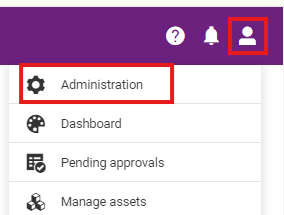
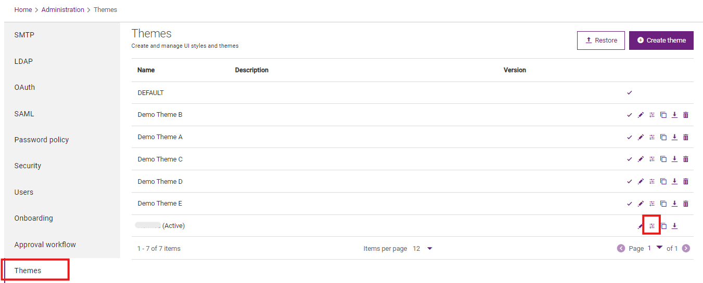
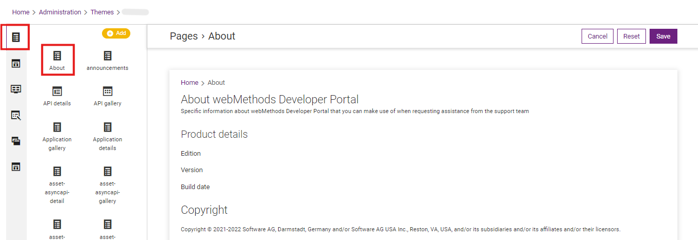

## Edit page

1.  Go to Administration setting

2.  

3.  Go to Themes setting

4.  Select a theme

5.  Click on the "Customize" button

6.  

7.  

8.  Go to "Page"

9. To edit a page, click on the existing page to update page.

